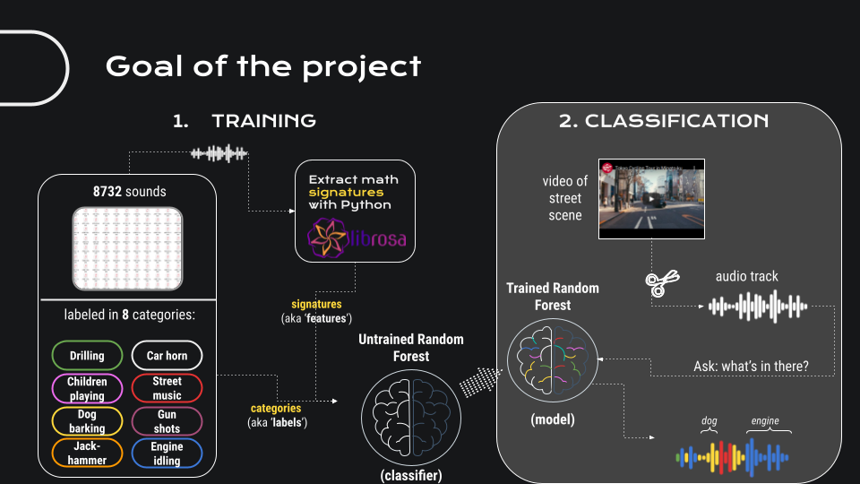
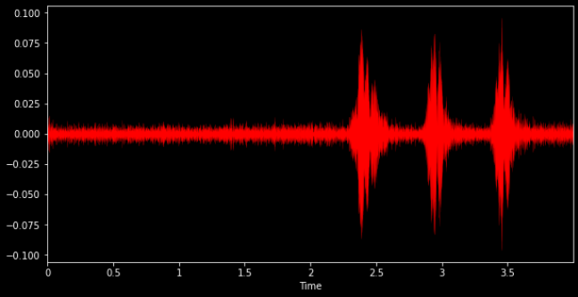
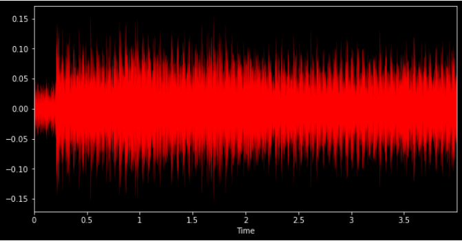
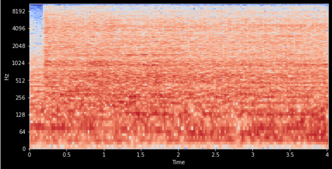

# Urban sound classification using machine learning

The aim of this project was to enable a machine to classify unknown urban sounds into 8 different categories. The automated classification of environmental sounds and specifically urban sounds is an active field of research (See references in [[2]](http://www.justinsalamon.com/uploads/4/3/9/4/4394963/salamon_urbansound_acmmm14.pdf)). From almost 7000 `.wav`-files audio features were extracted mathematically using *Librosa*, a Python library widely used in music and audio analysis. These features together with the corresponding categories of the urban sound were then used to train a machine learning model. Predicting the categories of 1700 (test) sounds from the same dataset, an accuracy score of around 90% was achieved with a random forest classifier, using an optimized number of trees as well as optimized number of features. Optimization was achieved by minimizing the *out of bag score* for the random forest.

*Goal of the project (slide taken from my final project presentation at the end of the Ironhack Bootcamp)*

# 1. Dataset

The source is the *UrbanSound8K* [dataset](https://urbansounddataset.weebly.com/) compiled by Justin Salamon, Christopher Jacoby and Juan Pablo Bello and can be used under the *Creative Commons Attribution Noncommercial License* (by-nc). It contains 8732 labeled sound samples from field recordings uploaded to www.freesound.org, each with a duration of below 4 seconds. A meta `.csv`-file is also provided, which allows to connect filenames with the sound class. The 10 classes of the sounds were:

* `air_conditioner`
* `car_horn`
* `children_playing`
* `dog_bark`
* `drilling`
* `engine_idling`
* `gun_shot`
* `jackhammer`
* `siren`
* `street_music`

# 2. Feature generation

## 2.1. Librosa features

* Librosa's `core.load()` function is used to load the sound files as an audio time series into Jupyter Notebook (together with their corresponding sampling rate). Librosa ensures that all sampling rates are set to 22.05 KHz and  normalises the data so the bit-depth values range between -1 and 1. Also all audio channels will be transformed into mono.

* Librosa among other things allows to plot **amplitude over time** with `librosa.display.waveplot()` or **frequency spectra over time** with `librosa.display.specshow()`. In the following those are shown for `161922-3-1-5.wav` which is a `dog_bark`. Harmonic frequency multipliers are clearly visible. It's presence is an important feature of that class `dog_bark` which sets it apart from classes whose sounds don't emerge from resonant bodies (a `jackhammer` e.g.)

Amplitude envelope of the waveform of a `dog_bark` |  Frequency spectrum of a `dog_bark`
:-------------------------:|:-------------------------:
  |  

Amplitude envelope of the waveform of a `jackhammer` |  Frequency spectrum of a `jackhammer`
:-------------------------:|:-------------------------:
  |  

## 2.2. Gathering all data in a dataframe

# 3. Machine learning

sklearn pipepline, standard scaler, random forest, model export

## Hyperparameter tuning

# Results

# Outlook

* 

# Structure of the project

folders:

* `data`
* `img`

notebooks:

|        filename           |    description     |
|:--------------------------|--------------------|
| `ml.ipynb`                ||
| `exploring_librosa.ipynb` ||
| `demonstrator.ipynb`      | A demonstrator built for the final project presentation |

modules:

|        filename           |    description     |
|:--------------------------|--------------------|
| `generate_features.py`    ||
| `structure_helpers.py`    ||

# Links

* Source of the dataset: https://urbansounddataset.weebly.com/
* [2] Explaining paper for the dataset by Salamon et. al, [link](http://www.justinsalamon.com/uploads/4/3/9/4/4394963/salamon_urbansound_acmmm14.pdf)
